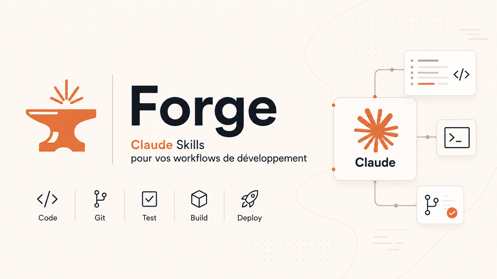

Collection de skills Claude Code regroupées par **plugins thématiques**, installables dans n'importe quel projet via `/plugin`. Une petite forge où je façonne mes outils pour Claude Code et que je partage en libre-service.

- **Marketplace** : `gabrielmustiere`
- **Source** : `gabrielmustiere/skills` (ce repo)

## Installation

Dans une session Claude Code ouverte sur n'importe quel projet :

```
/plugin marketplace add gabrielmustiere/skills
/plugin install workflow@gabrielmustiere
/plugin install sylius@gabrielmustiere
/plugin install symfony@gabrielmustiere
/plugin install editorial@gabrielmustiere
/reload-plugins
```

Les skills d'un plugin sont toujours namespacées par le nom du plugin :

```
/workflow:help
/workflow:feature-pitch
/workflow:doc-feature
/symfony:doctrine-entity
/editorial:article-plan
```

Mettre à jour le catalogue : `/plugin marketplace update gabrielmustiere` puis `/reload-plugins`.

## Tutoriel — Prendre en main le plugin `workflow`

Le plugin `workflow` est le plus structurant de la Forge : il pilote tout le cycle de développement (de la vision projet jusqu'au commit) en un pipeline d'étapes courtes, validées une à une avec l'utilisateur. Ce tutoriel t'amène pas-à-pas de l'installation à ta première feature livrée.

### Philosophie en trois idées

1. **Une étape = une skill = un artefact.** Chaque skill produit un fichier markdown (`feature.md`, `design.md`, `plan.md`, `review.md`, `report.md`) qui sert d'entrée à la suivante. Tu ne passes jamais à l'étape d'après sans validation explicite (`ok`, `go`, `validé`).
2. **Trois tracks symétriques selon la nature du changement.** Une feature visible utilisateur, un refacto qui ne change rien dehors, ou une évolution technique (perf/résilience/sécu/observabilité) qu'un monitoring voit. Le pipeline est le même, seuls les premiers skills changent.
3. **Stack-agnostique avec règles framework auto-chargées.** Le workflow détecte ton stack (Symfony, Sylius…) via `composer.json` / `package.json` et charge les bonnes conventions de QA, sécu, perf au bon moment. Tes conventions projet (commandes exactes, credentials de test…) vivent dans le `CLAUDE.md` à la racine.

### Carte mentale du pipeline

```
PHASE 0 (une fois)
  /workflow:vision           → docs/vision.md (problème, audience, North Star)
  /workflow:product-backlog  → docs/product-backlog.md (domaines, capacités, MVP/V2/V3)

CHOIX DU TRACK
  Feature (user-facing)  : feature-pitch → feature-design → feature
  Refacto (comportement figé) : refactor-plan → refactor
  Tech (perf/sécu/obs)   : tech-plan → tech

FIN DE CYCLE (commune aux 3 tracks)
  review → commit → report → sync
```

Tout vit dans `docs/story/NNN-<f|r|t>-<slug>/` (compteur global → tri lexicographique = timeline du projet). Exemple : `docs/story/042-f-checkout-express/feature.md`.

### Premier réflexe — `/workflow:help`

Avant tout, tape `/workflow:help` dans Claude Code. Tu obtiens le sommaire du pipeline, les tracks, et le rappel des artifacts. Quand tu es perdu en cours de feature ("je suis où ?"), c'est le geste à faire.

### Tour des skills, dans l'ordre où tu les rencontreras

#### Phase 0 — Poser le décor (une fois par projet)

Ces deux skills se lancent en tout début de projet, et seulement lors d'un pivot stratégique ensuite. Ils sont facultatifs au sens strict (tu peux sauter direct au track feature), mais fortement recommandés dès que le projet dépasse 3-4 features.

- **`/workflow:vision`** — Atelier de cadrage qui produit `docs/vision.md`. Claude joue le rôle d'un sparring partner et challenge tes réponses : *quel problème exactement, pour qui, comment mesure-t-on le succès (North Star), quels principes non-négociables, et qu'est-ce qu'on refuse explicitement de faire (anti-objectifs) ?* Le document devient le verrou d'alignement de toutes les features futures.

- **`/workflow:product-backlog`** — Une fois la vision validée, ce skill la traduit en carte des **domaines fonctionnels** → **capacités** → **parcours utilisateur** → **règles transverses** → **backlog priorisé MVP/V2/V3**. Il pose le périmètre fonctionnel et l'ordre de bataille. Le document est vivant : tu le révises à chaque repriorisation ou nouvelle capacité identifiée.

#### Track feature — Apporter de la valeur utilisateur

Pour tout changement qu'un utilisateur final ou un admin peut décrire ("je vois maintenant un bouton X qui fait Y"). C'est le track le plus complet, en 3 phases avant le commit.

- **`/workflow:feature-pitch`** — Atelier de cadrage de l'idée. Claude lit `docs/vision.md` et `docs/product-backlog.md` pour challenger l'alignement (cette feature sert quelle capacité ? quel principe ? quel impact North Star ?), puis cadre le pitch : problème utilisateur, persona, valeur, scope MVP vs hors-scope, critères d'acceptation, risques. Produit `docs/story/NNN-f-slug/feature.md`. **Refuse les formulations vagues** — c'est la skill qui te force à savoir ce que tu fais avant de coder.

- **`/workflow:feature-design`** — Une fois la spec validée, design technique : architecture, modèle de données, contrats d'API, impacts existants, stratégie de migration, plan de tests. Produit `docs/story/NNN-f-slug/design.md`. Le design est validé avant écriture de la moindre ligne de code.

- **`/workflow:feature`** — Implémentation guidée, sous-tâche par sous-tâche, avec QA continue (lint, types, tests) à chaque étape. Tu valides chaque sous-tâche avant de passer à la suivante. Produit le code, les migrations, les tests.

#### Track refacto — Comportement figé, code restructuré

Pour restructurer du code (dette, couplage, préparer une feature à venir, extraire un service) **sans toucher au comportement externe** (mêmes réponses, events, logs, timings).

- **`/workflow:refactor-plan`** — Cadrage : motivation, périmètre cible, **tests de caractérisation** à poser comme verrou avant de modifier, étapes incrémentales réversibles. Produit `docs/story/NNN-r-slug/plan.md`.

- **`/workflow:refactor`** — Exécution avec **verrou tests d'abord**, puis étapes incrémentales : à chaque étape les tests doivent rester verts. Si une étape casse, on revient et on découpe plus fin.

#### Track tech — Perf, résilience, observabilité, sécu (non user-facing)

Pour les changements qu'un observateur externe (test, monitoring, log consumer, autre service) détecte, mais pour **mieux** : plus rapide, plus résilient, plus sûr. Cache, retry, circuit breaker, queue async, logs structurés, index SQL, CSP, bump de CVE…

- **`/workflow:tech-plan`** — Cadrage avec **métrique cible chiffrée obligatoire** (ex: "latence p95 < 200 ms vs 800 ms aujourd'hui"), baseline à mesurer avant toute modif, kill switch activable, étapes incrémentales mesurées. Produit `docs/story/NNN-t-slug/plan.md`.

- **`/workflow:tech`** — Exécution : tu mesures la baseline, tu poses le kill switch, puis chaque étape se termine par une nouvelle mesure. Si la métrique régresse, on annule.

#### Fin de cycle — Commune aux trois tracks

Après l'implémentation, le pipeline converge sur quatre skills qui s'enchaînent toujours dans le même ordre.

- **`/workflow:review`** — Code review du diff : sécurité (OWASP, secrets), qualité (lint, typing, complexité), conformité au design (ce que dit `design.md` ou `plan.md` est-il bien là ?), non-régression. Produit `review.md` avec un statut bloquant / non-bloquant.
- **`/workflow:commit`** — Génère un message Conventional Commits en français à partir du diff et du contexte de la story, puis commit et push. Pas de message générique : il décrit l'**intention** (le pourquoi), pas le quoi.
- **`/workflow:report`** — Compte rendu honnête de ce qui a été fait **vs ce qui était prévu** dans `feature.md` / `design.md` / `plan.md`. Liste les écarts, les compromis pris en cours de route, les TODOs ouverts. Produit `report.md`.
- **`/workflow:sync`** — Si le report révèle que la doc d'intention a divergé du code livré, ce skill réaligne `feature.md` / `design.md` / `plan.md` sur la réalité, pour que la story reste lisible dans 6 mois.

### Track "fast" — Bugfix express (hors pipeline structuré)

Pour les modifs qui cochent **toutes** ces cases : moins de 3 fichiers, pas de migration, pas de nouveau service/entité, pas d'impact transverse. Tu codes, tu lances la QA du stack, tu vises `/workflow:review` (optionnel) puis `/workflow:commit`. Pas de feature-pitch ni de design pour un typo ou un nullcheck oublié.

### Utilitaires hors pipeline

- **`/workflow:test-scenario`** — Joue un scénario utilisateur en live dans un navigateur piloté par Playwright MCP. Utile pour valider une feature en bout de chaîne.
- **`/workflow:doc-feature`** — Cartographie une feature **existante** (legacy non documentée) en un `feature.md` rétro-ingénierié. Stack-aware (Symfony, Sylius).
- **`/workflow:migrate-legacy`** — Migre les anciens dossiers `docs/story/<f|r|t>-NNN-<slug>/` vers le format `NNN-<f|r|t>-<slug>/` (compteur en tête) via `git mv`.
- **`/workflow:import-external`** — Importe une doc produite par Spec Kit, BMAD-METHOD ou GSD vers le format workflow.
- **`/workflow:release`** — Tag SemVer annoté + `CHANGELOG.md` Keep a Changelog + release GitHub. À lancer en fin de jalon, pas après chaque feature.

### Première feature de bout en bout — exemple concret

Imaginons qu'on démarre un projet de gestion d'événements, et qu'on veut livrer la première feature : "permettre à un organisateur de publier une page d'événement".

```
Session 1 — Pose les fondations (une fois pour toute la vie du projet)
  /workflow:vision           → docs/vision.md
  /workflow:product-backlog  → docs/product-backlog.md

Session 2 — Première feature
  /workflow:feature-pitch    → docs/story/001-f-publier-page-evenement/feature.md
  /workflow:feature-design   → docs/story/001-f-publier-page-evenement/design.md
  /workflow:feature          → code + migrations + tests
  /workflow:review           → docs/story/001-f-publier-page-evenement/review.md
  /workflow:commit           → commit + push
  /workflow:report           → docs/story/001-f-publier-page-evenement/report.md
  /workflow:sync             → réalignement éventuel feature.md / design.md
```

À l'issue de la session 2, `docs/story/001-f-publier-page-evenement/` contient cinq fichiers qui racontent l'histoire complète de la feature (du pitch à la livraison) — relisable dans 6 mois sans contexte.

### Bonnes pratiques pour démarrer

- **Valide explicitement à chaque étape.** Claude attend `ok` / `go` / `validé`. Si tu ne valides pas, il ne passe pas à la suite — c'est le verrou anti-dérive.
- **Garde ton `CLAUDE.md` à jour.** Commandes QA exactes (`./bin/phpunit`, `yarn build`…), credentials de test, noms de thèmes utilisés, branches. Les skills le lisent à chaque exécution.
- **Ne saute pas le `report.md`.** C'est lui qui révèle les écarts entre intention et réalité, et donc l'utilité du `sync` qui suit.
- **Si tu hésites sur le track**, demande-toi : *un user voit-il quelque chose de nouveau ?* (→ feature) *Un monitoring détecte-t-il une différence ?* (→ tech) *Personne ne voit la différence dehors ?* (→ refacto).
- **`/workflow:help` est ton GPS** quand tu perds le fil du pipeline.

## Plugins disponibles

| Plugin | Version | Description |
| --- | --- | --- |
| `workflow` | `0.17.0` | Pipeline de développement stack-agnostique. **Phase 0** : `vision` produit `docs/vision.md` (problème, audience, North Star, principes, anti-objectifs). **Phase 0.5** : `product-backlog` traduit la vision en domaines, capacités, parcours et backlog priorisé MVP/V2/V3 → `docs/product-backlog.md`. Ces deux documents fondateurs sont lus par `feature-pitch` pour challenger l'alignement et reprendre le pitch backlog. Trois tracks symétriques : **feature** (`feature-pitch` → `feature-design` → `feature`), **refacto** (`refactor-plan` → `refactor`), **évolution technique** (`tech-plan` → `tech`). Étapes communes : `review` → `commit` → `report` → `sync`. Outillage transverse : `migrate-legacy`, `import-external`, `release`, `doc-feature` (carte d'une feature existante, stack-aware). Détection auto du stack (Symfony, Sylius). |
| `sylius` | `0.26.0` | Skills pour travailler avec Sylius (conventions, entités traduisibles, customization de modèle/form/grid/template/styles/dynamic/validation/state-machine/translation/fixtures, commandes, e-mails, promotions panier, coupons, ajustements). Pour la documentation d'une feature existante, voir `workflow:doc-feature`. |
| `symfony` | `0.12.0` | 25 skills Symfony/Doctrine groupées par domaine : **doctrine** (entity, migration, query), **events** (dispatch, listen, subscribe), **forms** (type, handle, render, advanced), **http** (controller-action, routing-define), **http-client** (request, response, async, test), **messenger** (async), **serializer** (use), **object-mapper**, **services** (define, wire, tags), **validation** (constraints, groups, use). Relayées par `workflow` quand le stack détecté est Symfony/Sylius. |
| `editorial` | `0.3.0` | Pipeline éditorial en trois étapes — `article-plan` (cadrage), `article` (rédaction guidée + vérifications + traduction) et `article-rework` (retouche chirurgicale d'une portion d'un article publié) — pour articles de blog et fiches side-project. Stack-agnostique : détecte Astro Content Collections, Next.js MDX, Hugo, Jekyll ou markdown brut. Artifacts unifiés sous `docs/story/a-NNN-slug/`. |

## Inventaire des skills

### `workflow` — Pipeline de développement (19 skills)

| Skill | Rôle |
| --- | --- |
| [`help`](plugins/workflow/skills/help/SKILL.md) | Sommaire du workflow, tracks, skills et artifacts |
| [`vision`](plugins/workflow/skills/vision/SKILL.md) | **Phase 0** — atelier de cadrage de la vision projet (problème, audience, valeur, North Star, principes, anti-objectifs) → `docs/vision.md` |
| [`product-backlog`](plugins/workflow/skills/product-backlog/SKILL.md) | **Phase 0.5** — traduit la vision en domaines, capacités, parcours et backlog priorisé MVP/V2/V3 → `docs/product-backlog.md` |
| [`feature-pitch`](plugins/workflow/skills/feature-pitch/SKILL.md) | Atelier de cadrage d'une idée de feature → `feature.md` |
| [`feature-design`](plugins/workflow/skills/feature-design/SKILL.md) | Design technique d'une feature cadrée → `design.md` |
| [`feature`](plugins/workflow/skills/feature/SKILL.md) | Implémentation guidée à partir du design |
| [`refactor-plan`](plugins/workflow/skills/refactor-plan/SKILL.md) | Cadrage refacto + tests de caractérisation → `plan.md` |
| [`refactor`](plugins/workflow/skills/refactor/SKILL.md) | Exécution guidée d'un refacto avec verrou tests |
| [`tech-plan`](plugins/workflow/skills/tech-plan/SKILL.md) | Cadrage évolution technique (perf, résilience, sécu) → `plan.md` |
| [`tech`](plugins/workflow/skills/tech/SKILL.md) | Exécution d'une évolution technique avec baseline/kill switch |
| [`review`](plugins/workflow/skills/review/SKILL.md) | Code review du diff (sécurité, qualité, conformité) |
| [`commit`](plugins/workflow/skills/commit/SKILL.md) | Génère un Conventional Commit FR et push |
| [`report`](plugins/workflow/skills/report/SKILL.md) | Compte rendu intention vs code réel |
| [`sync`](plugins/workflow/skills/sync/SKILL.md) | Réaligne la doc d'intention avec le code livré |
| [`test-scenario`](plugins/workflow/skills/test-scenario/SKILL.md) | Joue un scénario utilisateur via Playwright MCP |
| [`migrate-legacy`](plugins/workflow/skills/migrate-legacy/SKILL.md) | Migre les anciens dossiers `<f\|r\|t>-NNN-<slug>/` vers `NNN-<f\|r\|t>-<slug>/` (compteur en tête) via `git mv` |
| [`import-external`](plugins/workflow/skills/import-external/SKILL.md) | Importe une doc Spec Kit / BMAD-METHOD / GSD vers le format `docs/story/NNN-<f\|r\|t>-<slug>/` |
| [`release`](plugins/workflow/skills/release/SKILL.md) | Tag annoté SemVer + `CHANGELOG.md` Keep a Changelog + release GitHub |
| [`doc-feature`](plugins/workflow/skills/doc-feature/SKILL.md) | Documente une feature existante (stack-agnostique, détection Sylius/Symfony) → `docs/feature-map/NNN-slug/feature.md` |

### `sylius` — Skills Sylius (17 skills)

| Skill | Rôle |
| --- | --- |
| [`model`](plugins/sylius/skills/model/SKILL.md) | Étend un modèle Sylius natif (`Country`, `Customer`, `ShippingMethod`…) — extends + `implements Interface`, config `sylius_<bundle>.resources…classes.model`, migration |
| [`form`](plugins/sylius/skills/form/SKILL.md) | Étend un `FormType` Sylius via `AbstractTypeExtension` (shop vs admin vs base), priorité sur forms déjà étendus par le Core, Twig Hook pour le rendu, champs dynamiques via `PRE_SET_DATA` |
| [`grid`](plugins/sylius/skills/grid/SKILL.md) | Customise une grid Sylius (liste admin) — YAML dans `_sylius.yaml` (disable/réordonner champs, filtres, actions), PHP event listener `sylius.grid.<name>` via `GridDefinitionConverterEvent`, nouvelle grid sur resource custom via `AbstractGrid` + `#[AsGrid]`, filtres sur relations via `setRepositoryMethod()` ou `DataProviderInterface`, tri, pagination |
| [`template`](plugins/sylius/skills/template/SKILL.md) | Customise un template Sylius via Twig Hooks (recommandé), override `templates/bundles/` en dernier recours, ou Sylius Themes — hooks hiérarchiques, priorités par pas de 100, `enabled: false`, Twig Components |
| [`menu`](plugins/sylius/skills/menu/SKILL.md) | Customise un menu Sylius 2.x — sidebar admin/compte client via Event Listener (`MenuBuilderEvent`, events `sylius.menu.admin.main` / `sylius.menu.shop.account`), boutons d'action et onglets form produit/variante via Twig Hooks, icônes Tabler via `ux_icon()`, migration des events 1.x dépréciés |
| [`styles`](plugins/sylius/skills/styles/SKILL.md) | Customise les styles Sylius 2.x (admin Tabler / shop Bootstrap) — override des variables `--tblr-*` / `--bs-*` dans `assets/<contexte>/styles/custom.scss`, import entrypoint, `yarn build`, `cache:clear` + hard refresh |
| [`dynamic`](plugins/sylius/skills/dynamic/SKILL.md) | Customise les éléments dynamiques Sylius 2.1+ (Symfony UX + Stimulus) — auto-discovery d'un `*_controller.js`, binding via `stimulus_controller()`, injection Twig Hook, `controllers.json` pour désactiver/gouverner un natif (`enabled: false`, `fetch: lazy\|eager`), enregistrement manuel via `bootstrap.js` |
| [`validation`](plugins/sylius/skills/validation/SKILL.md) | Customise la validation d'une resource Sylius via `config/validator/<Model>.yaml` + groupe custom rebranché sur `sylius.form.type.*.validation_groups` — cas standard (ex. min length `ProductTranslation.name`), cas spéciaux `ShippingMethodRule`/`PromotionRule`/`PromotionAction` via `ChannelCodeCollection` + paramètre indexé par rule key |
| [`state-machine`](plugins/sylius/skills/state-machine/SKILL.md) | Customise une state machine Sylius (Symfony Workflow) — ajout de `place`/`transition` via `config/packages/_sylius.yaml` + constantes `OrderCheckoutTransitions::GRAPH`, suppression/extension via `CompilerPassInterface` sur `state_machine.<graph>.definition` enregistré dans `Kernel::build()`, listeners sur `workflow.<graph>.completed.<transition>`, override d'un listener Sylius (`sylius.listener.workflow.*`), cas legacy Winzou |
| [`translation`](plugins/sylius/skills/translation/SKILL.md) | Customise les libellés traduits d'un resource Sylius — override via `translations/<domaine>.<locale>.yaml` (`messages`, `validators`, `flashes`, `security`), repérage clé via Symfony Profiler, priorité app > plugin > vendor, fallback locale, `cache:clear` obligatoire |
| [`fixtures`](plugins/sylius/skills/fixtures/SKILL.md) | Customise les fixtures Sylius — modification de la suite `default` dans `config/packages/sylius_fixtures.yaml` (currencies, channels, shipping/payment methods custom), extension d'un `ExampleFactory` + `Fixture` pour exposer un champ custom sur entité étendue (Factory + `configureResourceNode` + service taggé `sylius_fixtures.fixture`), listing via `sylius:fixtures:list`, chargement via `sylius:fixtures:load` |
| [`translation-entity`](plugins/sylius/skills/translation-entity/SKILL.md) | Crée la paire entité traduisible + `*Translation` (personal translations, `TranslatableTrait`, fallback locale) |
| [`order`](plugins/sylius/skills/order/SKILL.md) | Crée/manipule/fait transiter un `Order` (factories, `OrderItemQuantityModifier`, `OrderProcessor`, state machines) |
| [`email`](plugins/sylius/skills/email/SKILL.md) | Envoie ou personnalise un e-mail Sylius (`Sender`, `EmailManager`, templates par canal, `SyliusMailerBundle`) |
| [`cart-promotion`](plugins/sylius/skills/cart-promotion/SKILL.md) | Crée et applique une promotion panier (rules, actions, filtres taxon, priorité, exclusivité, `PromotionProcessor`) |
| [`coupon`](plugins/sylius/skills/coupon/SKILL.md) | Crée, applique ou génère en bulk des `PromotionCoupon` (promo `couponBased=true`, expirationDate, usageLimit, `PromotionCouponGenerator`) |
| [`adjustment`](plugins/sylius/skills/adjustment/SKILL.md) | Crée ou manipule un `Adjustment` sur `Order`/`OrderItem`/`OrderItemUnit` (types promo/shipping/tax, neutral, `lock()` survie aux recalculs) |

### `symfony` — Skills Symfony/Doctrine (25 skills)

| Domaine | Skill | Rôle |
| --- | --- | --- |
| **doctrine** | [`doctrine-entity`](plugins/symfony/skills/doctrine-entity/SKILL.md) | Entité Doctrine : ORM, relations, types custom |
|  | [`doctrine-query`](plugins/symfony/skills/doctrine-query/SKILL.md) | Requête Doctrine : find/findBy, DQL, QueryBuilder, DBAL |
|  | [`doctrine-migration`](plugins/symfony/skills/doctrine-migration/SKILL.md) | Migration : génération, dry-run, réversibilité |
| **events** | [`event-dispatch`](plugins/symfony/skills/event-dispatch/SKILL.md) | Définit et dispatche un événement custom |
|  | [`event-listen`](plugins/symfony/skills/event-listen/SKILL.md) | Event Listener (`#[AsEventListener]`) |
|  | [`event-subscribe`](plugins/symfony/skills/event-subscribe/SKILL.md) | Event Subscriber (multi-callbacks, priorités) |
| **forms** | [`form-type`](plugins/symfony/skills/form-type/SKILL.md) | Classe FormType (AbstractType, buildForm) |
|  | [`form-handle`](plugins/symfony/skills/form-handle/SKILL.md) | Traitement en contrôleur (createForm, handleRequest, PRG) |
|  | [`form-render`](plugins/symfony/skills/form-render/SKILL.md) | Rendu Twig (thèmes, customisation par bloc) |
|  | [`form-advanced`](plugins/symfony/skills/form-advanced/SKILL.md) | DataTransformer, FormEvents, CollectionType, FileType |
| **http** | [`controller-action`](plugins/symfony/skills/controller-action/SKILL.md) | Contrôleur fin (AbstractController, helpers, `#[MapQueryParameter]`, `#[MapRequestPayload]`) |
|  | [`routing-define`](plugins/symfony/skills/routing-define/SKILL.md) | `#[Route]` (path, methods, requirements, host, locale), génération d'URL, URIs signées |
| **http-client** | [`http-client-request`](plugins/symfony/skills/http-client-request/SKILL.md) | Construction d'une requête HTTP sortante |
|  | [`http-client-response`](plugins/symfony/skills/http-client-response/SKILL.md) | Consommation de réponse, exceptions, streaming |
|  | [`http-client-async`](plugins/symfony/skills/http-client-async/SKILL.md) | Concurrence, retry, cache, rate-limit, SSE |
|  | [`http-client-test`](plugins/symfony/skills/http-client-test/SKILL.md) | Mock HttpClient, MockResponse, HAR |
| **messenger** | [`messenger-async`](plugins/symfony/skills/messenger-async/SKILL.md) | Message + handler `#[AsMessageHandler]`, transports (doctrine/amqp/redis), retry, DLQ, worker |
| **serializer** | [`serializer-use`](plugins/symfony/skills/serializer-use/SKILL.md) | `SerializerInterface`, normalizers/encoders (json/xml/csv), `#[Groups]`, `#[Context]`, `#[DiscriminatorMap]` |
| **object-mapper** | [`object-mapper`](plugins/symfony/skills/object-mapper/SKILL.md) | Symfony ObjectMapper 7.3+ : `#[Map]` (target/source/if/transform), conditions, transformers, MapCollection |
| **services** | [`service-define`](plugins/symfony/skills/service-define/SKILL.md) | Déclaration (autowiring, autoconfiguration) |
|  | [`service-wire`](plugins/symfony/skills/service-wire/SKILL.md) | Câblage d'arguments (scalaires, env, alias, `#[Target]`) |
|  | [`service-tags`](plugins/symfony/skills/service-tags/SKILL.md) | Tags, collections, factories, décorateurs |
| **validation** | [`validation-constraints`](plugins/symfony/skills/validation-constraints/SKILL.md) | Contraintes `#[Assert\*]` sur entité/DTO/classe |
|  | [`validation-groups`](plugins/symfony/skills/validation-groups/SKILL.md) | Groupes, séquences, validation conditionnelle |
|  | [`validation-use`](plugins/symfony/skills/validation-use/SKILL.md) | `ValidatorInterface` hors form (DTO, payload, CLI) |

### `editorial` — Pipeline de rédaction (3 skills)

| Skill | Rôle |
| --- | --- |
| [`article-plan`](plugins/editorial/skills/article-plan/SKILL.md) | Atelier de cadrage d'un article de blog ou d'une fiche side-project — sujet, thèse, audience, recherche, chapitrage, tonalité, frontmatter prévisionnel adapté à la stack détectée → `docs/story/a-<NNN>-<slug>/plan.md` |
| [`article`](plugins/editorial/skills/article/SKILL.md) | Rédaction guidée à partir du `plan.md` validé — produit le fichier final dans la collection détectée (Astro CC, Next MDX, Hugo, Jekyll, markdown brut), frontmatter conforme au schéma, vérifications schéma + lint + format, traduction multilingue si prévue |
| [`article-rework`](plugins/editorial/skills/article-rework/SKILL.md) | Retouche chirurgicale d'une portion d'un article publié (chapitre, section, paragraphe) — respecte la voix de l'article, lit le `plan.md` associé, met à jour le plan si la promesse de la section change, propage à la traduction, vérifie schéma + lint + format |
